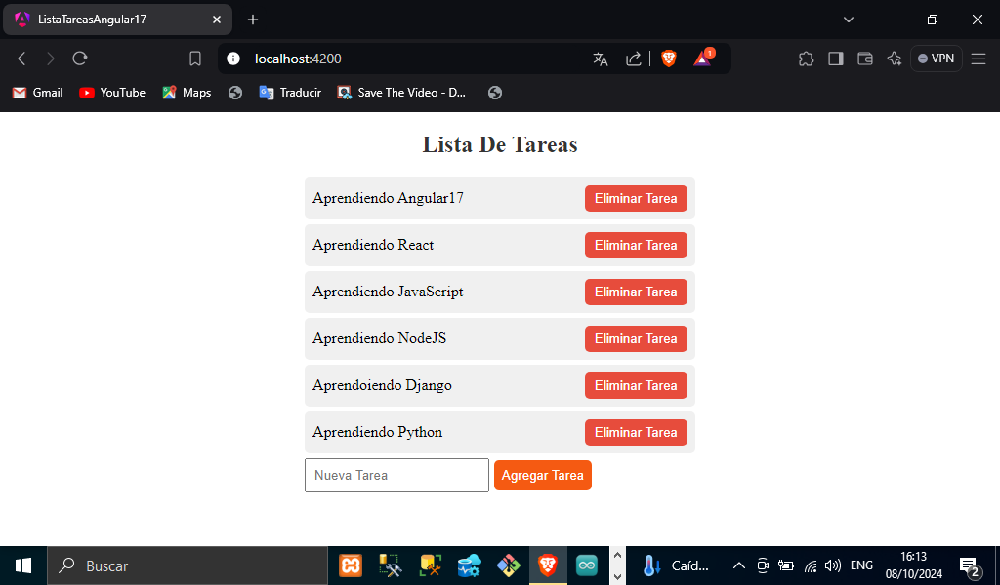
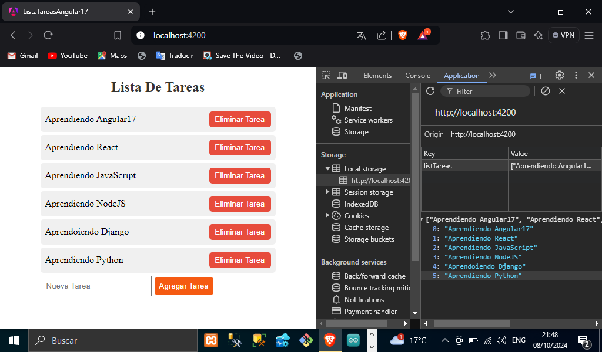

# TITULO DEL PROYECTO    

**Aplicación Web Lista De Tareas En Angular**

# DESCRIPCIÓN DEL PROYECTO (Manejo Del Local Storage En Angular17)
**En este proyecto se realizó una aplicación web en Angular 17, donde  podemos agregar tareas en el Local Storage y mostrarlas en la pantalla, así mismo podemos eliminar las tareas que queramos**

# VISTA PREVIA DE COMO SE VE NUESTRA APLICACION YA FUNCIONANDO



# EXPLICACION DETALLADA DEL PROYECTO(Código completo en el repositorio)

## Creación de Servicio en Angular(tareas.service.ts)
**Para hacer esta aplicación creamos un servicio en Angular(ng g s service/tareas).**

## Explicación más detallada del servicio creado
**El servicio creado en el proyecto contiene un localStorageKey esta es la variable que va contener el valor del key Storage que definimos como: 'listTareas' donde se van ir agregando las tareas que el usuario agregue**
## Métodos en el servicio (MostrarTareas, AgregarTareas y EliminarTareas)
**En el archivo de nuestro repositorio podrás ver los métodos creados para agregar, mostrar y eliminar las tareas del localStorage, podemos ver que en el método getTareas podemos traer todas las tareas del local Storage con la propiedad(localStorage.getItem) ya que con la propiedad JSON.parse nos trae la versión parseada en json de lo que tiene el local Storage. Ahora para poder hacer el método agregarTarea al local Storage hacemos uso de la propiedad(localStorage.setItem),además con la propiedad JSON.stringify mandamos ahora una versión de string del formato json. Por ultimo tenemos el método eliminarTarea del local Storage esto lo podemos realizar pasando como parámetro el index del elemento y haciendo uso de la propiedad splice podemos cambiar el contenido del array eliminando elementos existentes. Como se puede ver en el siguiente código:**

```TypeScript 
export class TareasService {
  private localStorageKey = 'listTareas';
    getTareas(): string[]{
        return JSON.parse(localStorage.getItem(this.localStorageKey) as string) || [];
    }
    agregarTarea(tarea: string){
        const tareas = this.getTareas()
        tareas.push(tarea);
        localStorage.setItem(this.localStorageKey, JSON.stringify(tareas));

    }
    eliminarTarea(index: number){
        const tareas = this.getTareas();
        tareas.splice(index, 1);
        localStorage.setItem(this.localStorageKey, JSON.stringify(tareas))
    }
}
```
## Inyección del servicio, ciclo de vida OnInit y FormsModel(app.component.ts)
**En esta parte vamos a inyectar el servicio en el componente con la propiedad de Angular inject ya que tenemos que importarlo de angular core, así como también el OnInit que el ciclo cuando el componente inicia en esta parte vamos a utilizar todos los métodos creados en el servicio(mostrar,agregarTareas y eliminarTareas), en esta parte tenemos que comunicar el componente ts con la plantilla HTML para esto hicimos uso de los formularios de Angular(FormsModule), esto tenemos que importarlos de angular/forms, para poder comunicar el input del formulario en el HTML y tener el control de lo que el usuario escriba en el input a continuación se muestra el código de la explicación anterior:**

```TypeScript
    import { Component, inject, OnInit } from '@angular/core';
    import { CommonModule } from '@angular/common';
    import { FormsModule } from '@angular/forms';
    import { TareasService } from './services/tareas.service';

    //aquí mismo importamos lo que vamos utilizar ya que es un componente standalone
    @Component({
    selector: 'app-root',
    standalone: true,
    imports: [CommonModule,RouterOutlet,FormsModule],
    })

    export class AppComponent implements OnInit {
        listaTareas:string[] = [];
        nuevaTarea:string = '';
        //aplicamos la inyeccion del servicio

        private _tareasService = inject(TareasService);

        ngOnInit(): void {
            this.listaTareas = this._tareasService.getTareas();
        }
        agregarTarea(){
            this._tareasService.agregarTarea(this.nuevaTarea);
            this.nuevaTarea = ''; //vaciamos el input
            this.listaTareas = this._tareasService.getTareas();
        }
        eliminarTarea(index: number){
            this._tareasService.eliminarTarea(index);
            this.listaTareas = this._tareasService.getTareas();
        }
    }
```
## Vista HTML de Angular(app.component.html)
**En el archivo app.component.html de nuestro repositorio mostramos las tareas que el usuario va agregando a través de una lista, así mismo mostramos los botones para agregar tarea y eliminar tarea que son métodos creados anteriormente y se ejecutan cuando el usuario le da clic al botón. En la lista podemos observar que usamos un ngFor para que se vallamos recorriendo las tareas que se van agregando y mostrarlas en la lista, podemos ver que el botón contiene el evento clic y dispara el método al que se hace referencia, por ultimo tenemos el input que es parte del formulario aquí comunicamos lo que el usuario escribe y podemos llevar el control es decir la comunicación entre el HTML y el TS con la propiedad de Angular (ngModel). Mostramos parte del código de lo explicado anteriormente:**
```HTML
    <ul>
        <li *ngFor="let tarea of listaTareas; let i = index">
        {{tarea}}
        <button (click)="eliminarTarea(i)">Eliminar Tarea</button>
        </li>
        <input type="text" placeholder="Nueva Tarea" [(ngModel)] =         "nuevaTarea"/>
        <button (click)="agregarTarea()">Agregar Tarea</button>
    </ul>
```
# VISTA DE LA PÁGINA Y LAS TAREAS AGREGADAS EN EL LOCAL STORAGE


### Lista De Tecnologías, Propiedades De Angular Y Herramientas Usadas En Nuestro Proyecto(Lista De Tareas)  

1. HTML
2. CSS 
3. TypeScript
4. Uso De *ngFor(Angular)
5. Método JavaScript(splice)
6. Uso De ngModel(Angular)
7. Uso De FormsModule(Angular) 
8. Ciclo De Vida OnInit(Angular) 
9. Uso De inject(Angular) 
10. Componente Standalone(Angular)
11. Manejo Del Local Storage 
12. GitHub

*Elaborado Por: Mario Martínez Aguilar*
 

